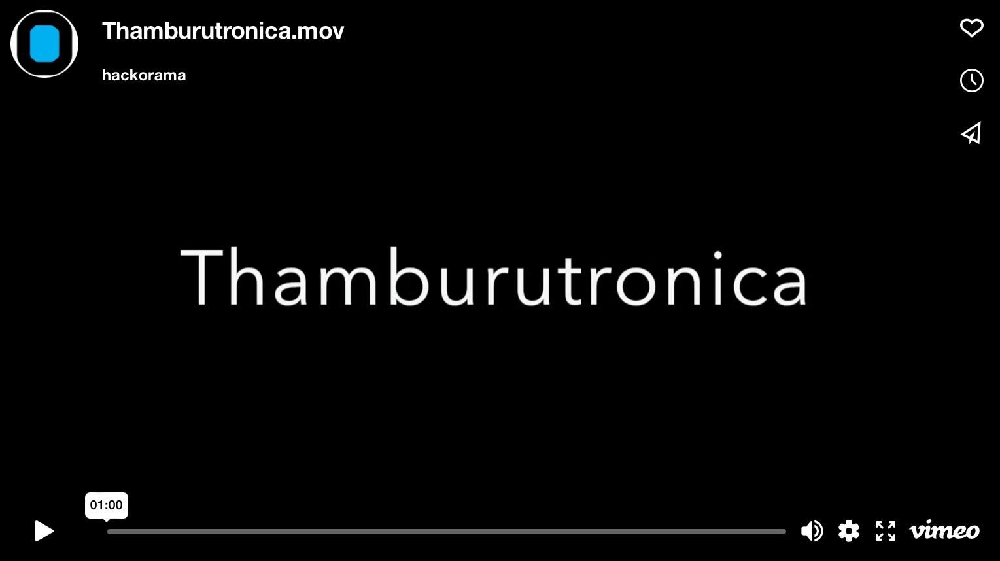

# Thamburutronica

A wood working and microcontroller project to create a touch sensor electronic chord version of Indian string instrument thamburu aka [thanpura, tambura,  tanpuri](https://en.wikipedia.org/wiki/Tanpura)

[More images](./images/README.md)

## Features

- Capacitive touch sensor chords
- Remote wireless control using mobile app
- Supports multiple audio modes
  - Touch mode - plays chord scales only when held down
  - Tap mode - starts/stops chord scales on single tap
  - Custom mode - Instead of chord scales, play any custom audio files
    - Add any ambient music, nature sounds, muzak, white noise etc.
    - Custom mode also supports a fun mode with random rickrolling for kids
- Clock with hourly chimes based on different thamburu scales
  - Can be customized - chime music, selected hours, holidays etc.
- An RGB LED for mode/status indicator and audio visualizer effects
  - Can be customized - fade effects, audio level effects etc.
- Auto power save with sleep and wake up

## Code

- [Microcontroller CircuitPython code](./src/microcontroller/README.md)
- [Mobile app](./src/mobile/README.md)
- [Wood work templates](./wood-work-templates/README.md)

## Design 

| [Microcontroller circuit hookup diagram](./src/microcontroller/docs/hookup-diagram.png) [PDF](./src/microcontroller/docs/hookup-diagram.pdf) [SVG](./src/microcontroller/docs/hookup-diagram.svg)|
| --- |
|  |

|  [Wood work main design](./wood-work-templates/design-template.png) [PDF](./wood-work-templates/design-template.pdf) [SVG](./wood-work-templates/design-template.svg) | [Wood work ornamentals](./wood-work-templates/ornamentals-templates.png) [PDF](./wood-work-templates/ornamentals-templates.pdf) [SVG](./wood-work-templates/ornamentals-templates.svg) |
| --- | ---|
| ||
