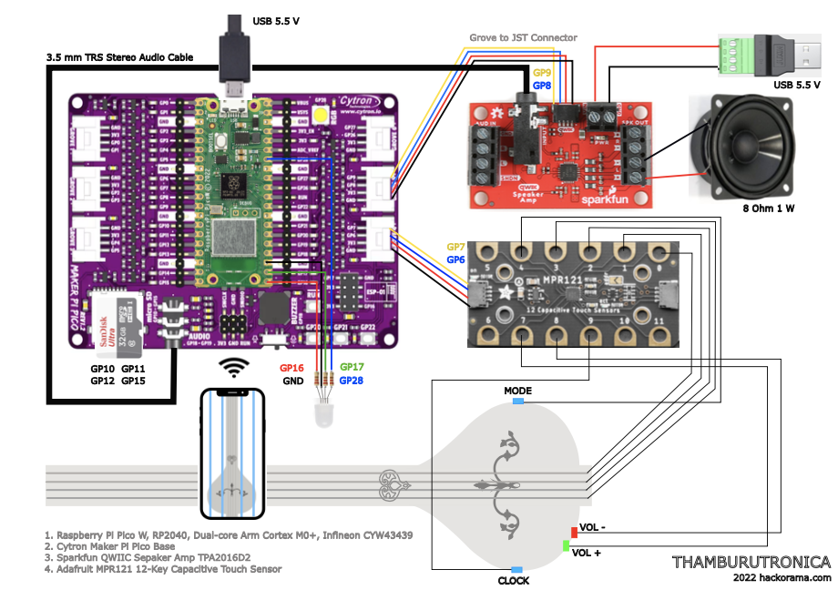

# Microcontroller code

CircuitPython code for Pi Pico W

## Overview

Main modules

- [Manager](./manager.py) - Event loop orchestration
- [Pico](./pico.py) - The microcontroller specific driver code for Pi Pico
- [Play](./play.py) - The microcontroller independent main device control logic

Sub modules - [Web](./web.py), [Chime](./chime.py), [Flair](./flair.py)

CircuitPython entry point [code.py](./code.py)

## Build

```shell
$ make help
help:        Show help
deps:        Install dev python packages
device:      Install circuitpython packages on device
check:       Run python code checks
compile:     Build mpy files
deploy:      Deploy mpy files to device
```

## Deploy

- [Boot Pi Pico W to CircuitPython 8.x](./docs/installing-circuitpython.md)
- [Install the required CircuitPython libraries](./docs/lib-dependencies.md)
- Copy the `*.py` or `*.mpy` code to USB mounted Pi Pico W - `make deploy`

> On macOS the CircuitPython USB mount point will be `/Volumes/CIRCUITPY`

## Hardware



[PNG](./docs/hookup-diagram.png) [PDF](./docs/hookup-diagram.pdf) [SVG](./docs/hookup-diagram.svg)


| Board                                                                                                    | Chip                                                                                                                                                          | Description                                |
|----------------------------------------------------------------------------------------------------------|---------------------------------------------------------------------------------------------------------------------------------------------------------------|--------------------------------------------|
| Raspberry Pi [Pico W](https://www.raspberrypi.com/documentation/microcontrollers/raspberry-pi-pico.html) | Raspberry Pi [RP2040](https://www.raspberrypi.com/documentation/microcontrollers/rp2040.html#welcome-to-rp2040)                                               | MCU                                        |
|                                                                                                          | Infineon [CYW43439](https://www.infineon.com/cms/en/product/wireless-connectivity/airoc-wi-fi-plus-bluetooth-combos/wi-fi-4-802.11n/cyw43439/?redirId=216343) | Wi-Fi, Bluetooth                           |
| Adafruit [12-Key Capacitive Touch Sensor](https://www.adafruit.com/product/4830)                         | NXP [MPR121](https://www.nxp.com/products/no-longer-manufactured/proximity-capacitive-touch-sensor-controller:MPR121)                                         | Proximity Capacitive Touch                 |
| Sparkfun [Qwiic Speaker Amp](https://www.sparkfun.com/products/20690)                                    | Texas Instruments [TPA2016D2](https://www.ti.com/product/TPA2016D2)                                                                                           | Audio amp                                  |
| Cytron [Maker Pi Pico Base](https://www.cytron.io/p-maker-pi-pico-base)                                  |                                                                                                                                                               | Base for micro SD card slot and audio jack |

Programmed using [CircuitPython 8](https://circuitpython.org/board/raspberry_pi_pico/)

## Memory handling notes

As new features were added (Wi-Fi, clock chimes etc.) had to make some changes to fit everything into the microcontroller memory.

Pi Pico W has only `264kB` RAM and `2MB` Flash storage.

- Removed non-essential features saving module import memory use
  - Logging with logging file handler, switched to simple console prints
  - Debug use of on-board buttons and neo pixel
  - Multi channel audio mixer
- Switch to memory and cpu efficient `wave` files instead of `mp3` files
  - The space non-efficient `wave` files are on the external SD card
- Late import of modules, aggressive periodic gc collection 
- Prefer bools/ints over strings, no object allocations in the event loop
- Compile to memory efficient `.mpy` files when deploying
- Audio LED visual effects made optional to reduce system load

On top of the memory constrain issues the system load caused audio playback quality issues.
The system load was affected by simultaneous processing - log writes and audio file reads from same
SD card storge, LED visual effects, system event checks on GPIO pins, wi-fi polling.

The log writes to the SD card (added to debug memory issues) were removed since this
with memory issues caused SD card corruptions during hard reset to recover hanging system.
And the audio files on the SD card were changed to read only mode to prevent corruptions
during hard reset.

## TODO

- Add detailed system status reportng - storage usage, cpu temp, versions etc.
- Extend device api for additional app controls - volume, chime on/off, mode selection
- Update to latest CircuitPython release version and update the packages
- Add ambient mode with loop playback in custom mode
- Restore console logging after memory issues are resolved
- Add Mypy type checking
- Use the app server time for NTP sync
- Add new LED visual effects
- Add audio messages during startup and control button clicks

