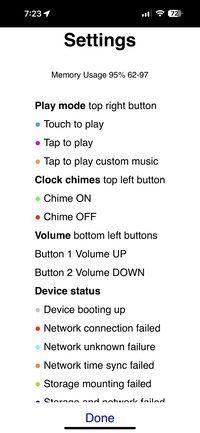

# Thamburutronica web app

A mobile web app to control the Thamburatronica device from the phone using the local Wi-Fi network.

| Ready                                  | Play                                   | Settings                               |
|----------------------------------------|----------------------------------------|----------------------------------------|
|  |  |  |


The Pi Pico W microcontroller used on the device comes with Wi-Fi connection and runs a web server.
But we use that web server only for basic HTTP API calls to control the device.
since we do not want the microcontroller to be overloaded serving the web app UI front end resources.

This mobile app service is deployed on a separate server like a Raspberry Pi or Mac mini on the same Wi-Fi network.

## Control flow

### Mac mini web app service

- Mobile app service starts on Mac mini
- Starts serving the web app on local Wi-Fi network

### Thamburutronica device

- Device on start up connects to the pre-configured Wi-Fi SSID access point
  - Starts an HTTP server and listens for device control API calls
  - Connects to the mobile app service on Mac mini and registers the device IP address

### Mobile phone web app UI

- On load the front end UI app checks for registered device connectivity using app service API
- If app service can ping the device the web app UI is loaded and ready to control the device
- And UI chord clicks are proxied/validated and send to the device by mobile app service
- if app service cannot ping the device an error message is shown on the UI to check device status

## Build

```shell
$ make help
help:    Show help
deps:    Install python packages
check:   Run python code checks
build:   Build typescript
deploy:  Run the server
```

## Server

```shell
$ make deploy
test -d venv || python3 -m venv venv
. venv/bin/activate && which python3 && python3 -m pip install --upgrade pip && pip3 -q install -r dev.requirements.txt && mypy --install-types
/Users/hackorama/thamburutronica/venv/bin/python3
Requirement already satisfied: pip in ./venv/lib/python3.8/site-packages (22.3.1)
. venv/bin/activate && isort . &&  black . &&  pylint *.py && mypy *.py
Skipped 3 files
All done! ✨ 🍰 ✨
1 file left unchanged.
--------------------------------------------------------------------
Your code has been rated at 10.00/10 (previous run: 10.00/10, +0.00)
Success: no issues found in 1 source file
tsc --strict
./server.sh
Server starting ...
Server started 34567 ...
```

```shell
$ tail -f server.log
INFO:     Uvicorn running on http://0.0.0.0:8888 (Press CTRL+C to quit)
...
INFO:     Application startup complete.
```

Stop the server

```shell
$ kill `cat run.pid`
```
