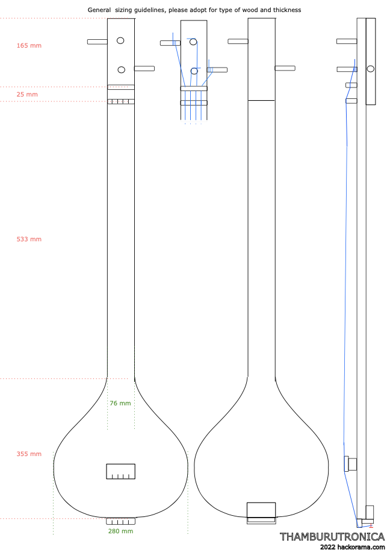
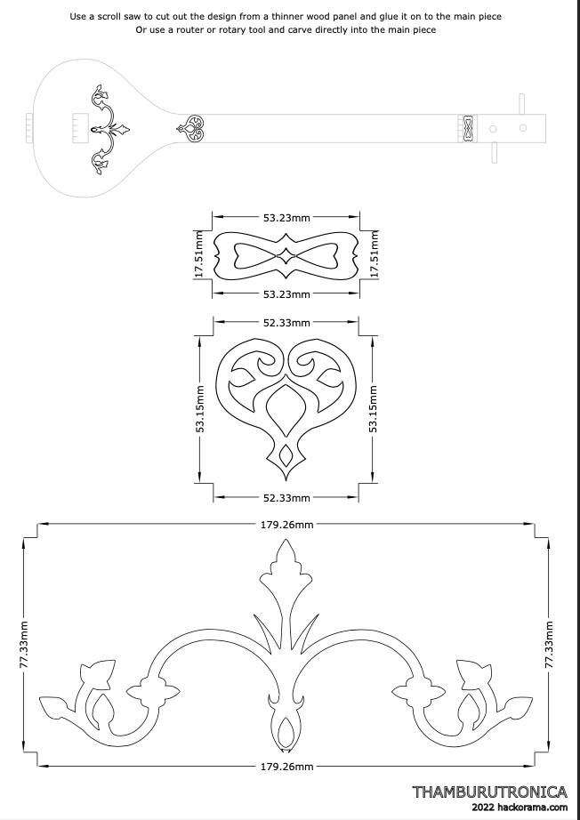

# Wood work templates

## Main design

General sizing guidelines, please adopt for type of wood and thickness.

[PNG](./design-template.png) [PDF](./design-template.pdf) [SVG](./design-template.svg)

## Ornamentals

Use a scroll saw to cut out the design from a thinner wood panel an glue it to the main piece.

Or use a router or rotary tool and carve directly into the main piece.

[PNG](./ornamentals-templates.png) [PDF](./ornamentals-templates.pdf) [SVG](./ornamentals-templates.svg)

